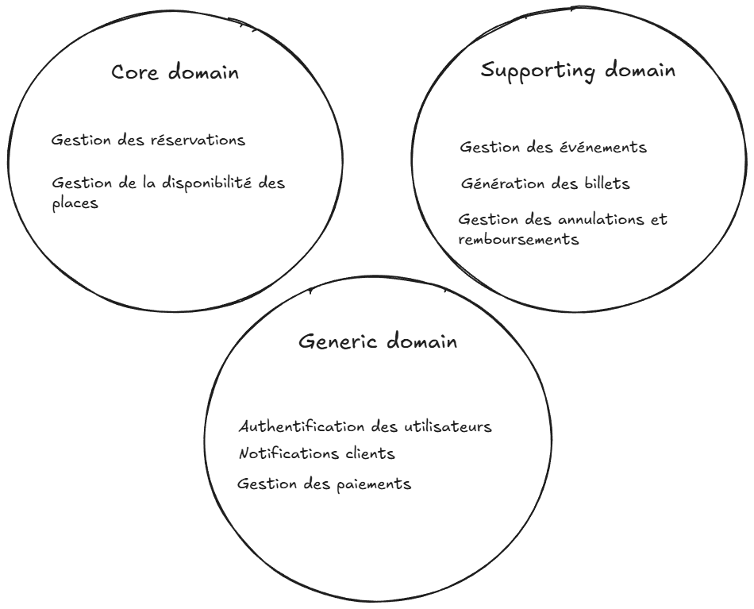

# Vue ensemble du domaine

## Liste des fonctionnalités

- Gestion des événements
- Gestion de la disponibilité des places
- Gestion des réservations
- Gestion des paiements
- Génération des billets
- Gestion des annulations et remboursements
- Notifications clients
- Authentification des utilisateurs

## Classification des sous-domaines

| Fonctionnalité                            | Type                  | Justification (2–3 phrases)                                                                                                                                                                                                                                                                                               |
| ----------------------------------------- | --------------------- | ------------------------------------------------------------------------------------------------------------------------------------------------------------------------------------------------------------------------------------------------------------------------------------------------------------------------- |
| Gestion des réservations                  | **Core Domain**       | La réservation est le mécanisme central permettant de bloquer temporairement des places et d’orchestrer leur vente. Elle gère des règles critiques comme l’expiration, la transformation en commande et la cohérence des quantités. C’est ici que réside la complexité principale et la valeur différenciante du système. |
| Gestion de la disponibilité des places    | **Core Domain**       | La disponibilité reflète l’état réel du stock vendable en tenant compte des réservations en cours, des ventes confirmées et des annulations. Elle doit être exacte en temps réel pour éviter le surbooking. Elle est étroitement liée au cœur de la logique de réservation.                                               |
| Gestion des événements                    | **Supporting Domain** | Cette fonctionnalité permet de créer et configurer les événements vendus sur la plateforme (dates, lieux, capacités, catégories). Elle structure l’offre mais repose principalement sur du paramétrage. Elle soutient le cœur métier sans porter la complexité stratégique principale.                                    |
| Génération des billets                    | **Supporting Domain** | La génération des billets matérialise le droit d’accès après validation d’une commande. Elle assure l’unicité, l’identification et la traçabilité des billets. Elle dépend du processus de réservation et de paiement, sans constituer le cœur différenciant du système.                                                  |
| Gestion des annulations et remboursements | **Supporting Domain** | Cette fonctionnalité gère les cas où une commande confirmée doit être annulée selon des règles définies. Elle applique les politiques d’annulation et déclenche des opérations financières inverses. Elle fait partie du cycle de vie des ventes mais n’est pas la source principale de valeur stratégique.               |
| Gestion des paiements                     | **Generic Domain**    | Le paiement repose sur des mécanismes standards généralement fournis par des prestataires externes spécialisés. Le système principal ne maîtrise pas la logique interne du traitement financier. Il s’agit d’une capacité indispensable mais largement commoditisée.                                                      |
| Notifications clients                     | **Generic Domain**    | L’envoi de notifications (emails, messages) est une fonctionnalité courante dans de nombreux systèmes. Elle peut être déléguée à des services tiers sans logique métier spécifique. Elle ne constitue pas un élément différenciateur du produit.                                                                          |
| Authentification des utilisateurs         | **Generic Domain**    | L’authentification permet d’identifier les utilisateurs mais repose sur des solutions standardisées. Elle peut être implémentée via des outils existants. Elle est nécessaire au fonctionnement global mais sans complexité métier propre.                                                                                |

